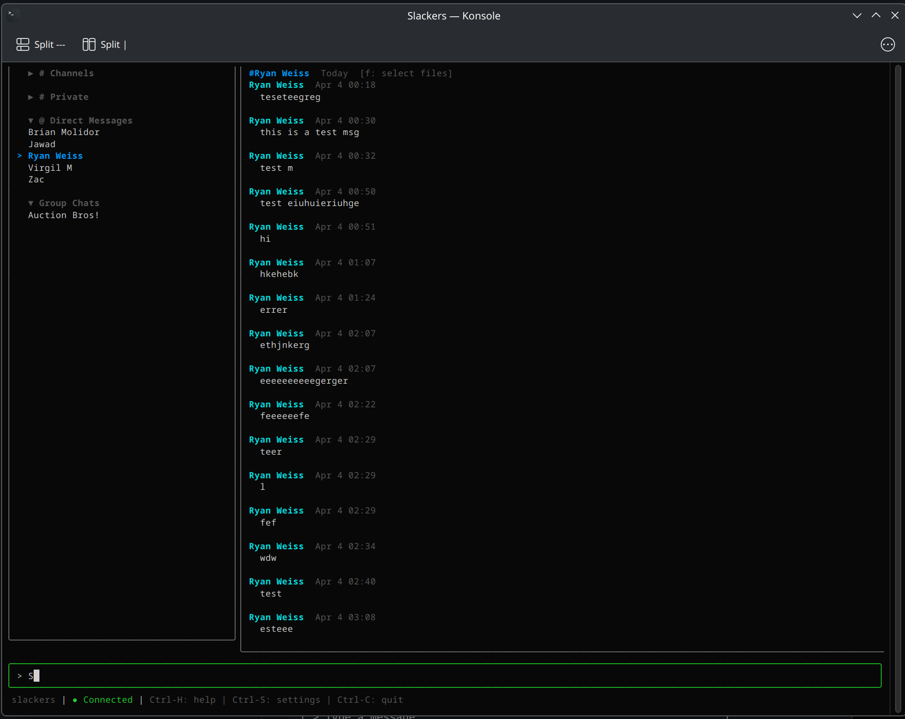
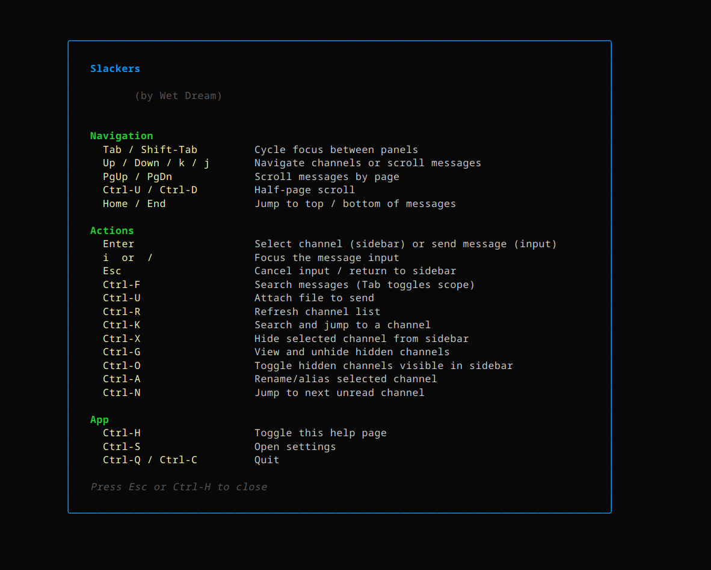
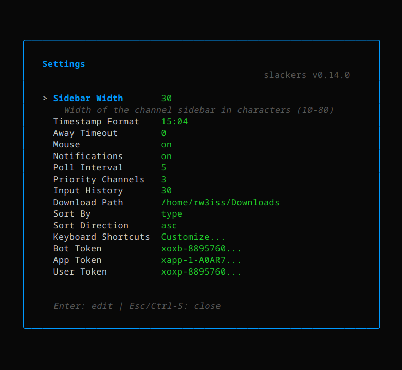
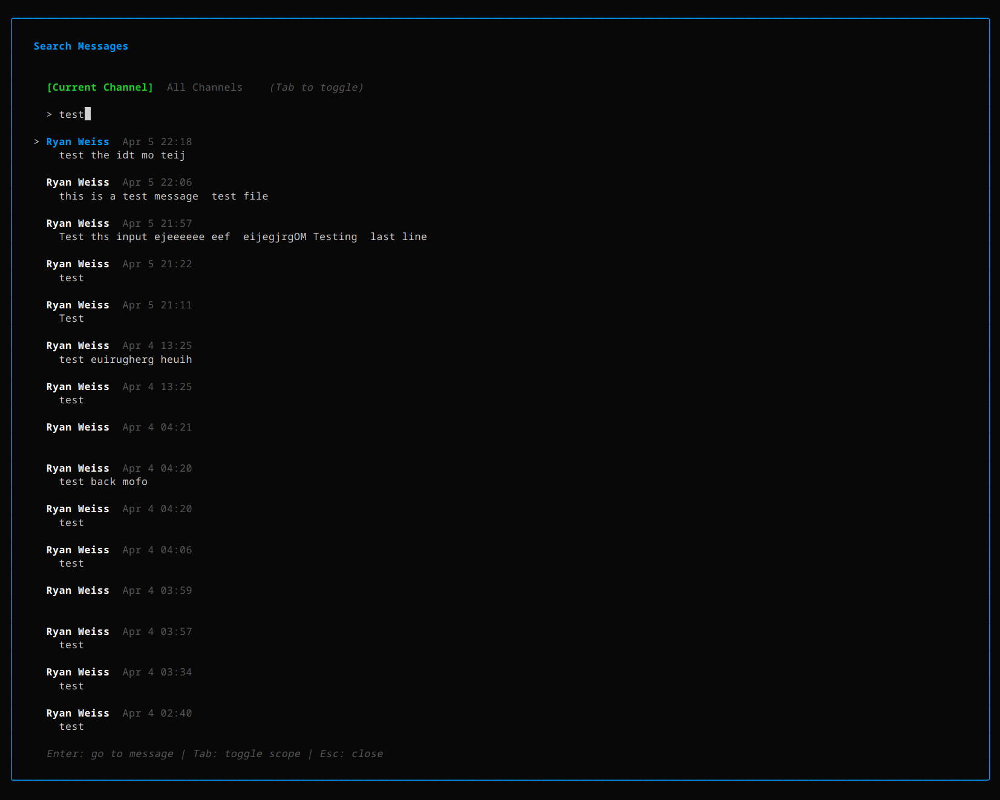
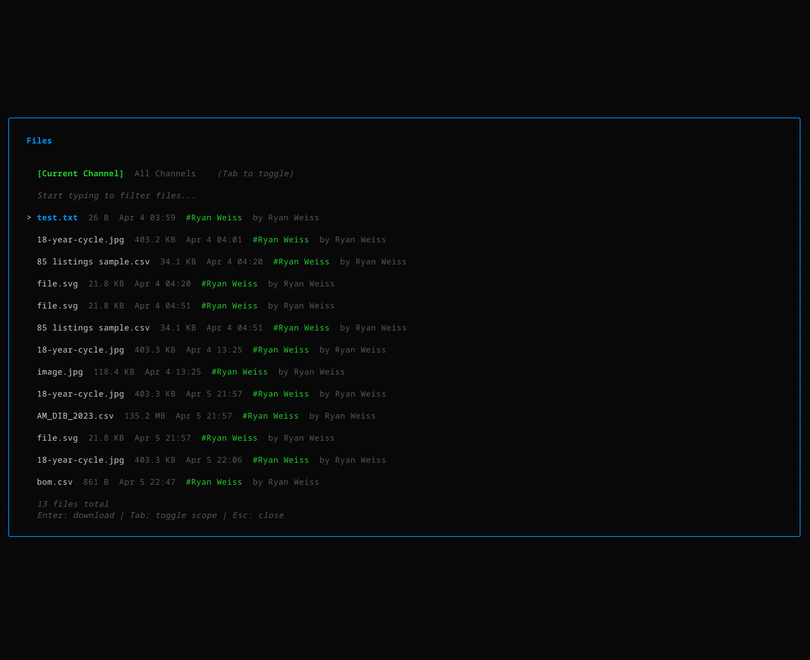
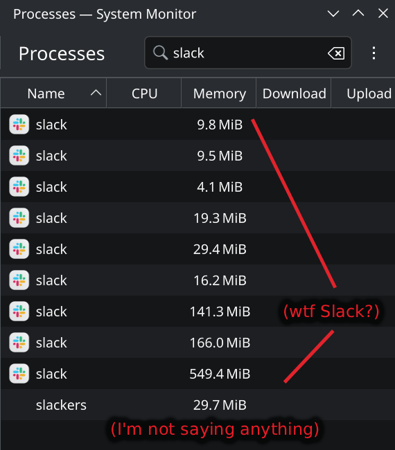

```
 ██████╗ ██╗      ██████╗  ██████╗██╗  ██╗███████╗██████╗  ██████╗
██╔════╝ ██║     ██╔═══██╗██╔════╝██║ ██╔╝██╔════╝██╔══██╗██╔════╝
╚█████╗  ██║     ████████║██║     █████╔╝ █████╗  ██████╔╝╚█████╗
 ╚═══██╗ ██║     ██╔═══██║██║     ██╔═██╗ ██╔══╝  ██╔══██╗ ╚═══██╗
██████╔╝ ███████╗██║   ██║╚██████╗██║  ██╗███████╗██║  ██║██████╔╝
╚═════╝  ╚══════╝╚═╝   ╚═╝ ╚═════╝╚═╝  ╚═╝╚══════╝╚═╝  ╚═════╝
```

A lightweight, terminal-based Slack client.

<a href=".github/screenshot.png"></a> <a href=".github/screenshot-help.png"></a> <a href=".github/screenshot-settings.png"></a> <a href=".github/screenshot-search.png"></a> <a href=".github/screenshot-files.png"></a> <a href=".github/screenshot-edit.png"></a>

## Features

- **Real-time messages** -- Socket Mode for instant delivery, with smart polling as a fallback
- **Message search** -- search current or all channels, jump to results with context view
- **File browser** -- upload, download, browse and search files across all channels
- **Mouse support** -- click channels, scroll panels, drag sidebar resize, click files, right-click for context menus
- **Multi-line editor** -- expandable textarea with normal/edit mode toggle
- **Slash commands** (`/`) -- typing `/` opens a fuzzy-matching suggestion popup above the input bar; built-in commands include `/help`, `/commands`, `/friends`, `/add-friend`, `/remove-friend`, `/theme`, `/themes`, `/channels`, `/clear-history`, `/me`, `/config`, `/settings`, `/shortcuts`, `/version`, `/quit`. Tab completes, Enter runs.
- **Output view** -- commands like `/help`, `/friends`, `/channels`, `/me` open a temporary console pane in place of the chat. Tab still cycles focus, switching channels closes it automatically, and running another command swaps the body in place.
- **Command List browser** (`Alt-C`) -- full-screen searchable list of every registered command with name + description + usage; Enter inserts into the input bar so you can fill in arguments.
- **Customizable shortcuts** -- rebind any key in-app, changes take effect immediately
- **Color themes** -- 15 built-in themes (6 light, 9 dark — light themes are tagged `(light)` in the picker), an in-app editor with a 256-color picker (fg/bg + bold/italic), live preview, and Ctrl-Y to flip between a primary + alternate theme
- **Reactions on replies, edit / delete own messages, inline reply selection** -- everything Slack does, in a TUI
- **In-message item navigation** -- in select mode (`Ctrl-J`), arrow keys cycle through every interactive item in a message in priority order: contact-card pills → file rows → reactions → reply list. Each selection shows a context-aware hint in the message header (`a`/`v`/`c` for cards, `Enter`/`c` for files).
- **Notifications view** (`Alt-N`) -- a single panel collects unread messages, reactions on your messages, and pending friend requests, each click jumps straight to the source
- **Right-click context menus** -- right-click a message for React / Reply / Edit / Delete, or a sidebar channel for Hide / Rename / Invite to Slackers / View Contact Info / Remove Friend (friend channels). Right-click a `[FRIEND:...]` pill in chat for Add Friend / View Contact Info / Copy Contact Info, with self/friend/non-friend variants.
- **Channel management** -- hide, alias (with a filterable Ctrl-G hidden-channels overlay), collapse groups, sort by type/name/recent
- **E2E encrypted messaging** -- optional P2P secure mode with X25519 key exchange
- **Friends list** -- private P2P chat with befriended Slackers users, works without a Slack workspace
- **Friend contact cards in chat** -- type `[FRIEND:me]` / right-click → "Invite to Slackers" to share a compact hash or full JSON profile that renders as a clickable pill on the receiver's side; click to import, merge, or replace
- **Automatic profile sync** -- connected peers exchange their latest contact card so stale fields (public key, multiaddr, email) get refreshed in place, without overwriting your chosen display name
- **Pending messages** -- messages sent while a friend was offline are flagged ⏳ pending, auto-resent in original order the moment the peer reconnects (via both a local reconnect detector and a `request_pending` pull from either side)
- **Backup & restore** -- `slackers export` / `slackers import` (and the Settings → Backup panel) produce a single-file zip of your entire config, with `replace` and `merge` modes
- **Auto-update** -- new versions downloaded and installed on startup
- **One-command onboarding** -- `slackers join <url>` for team setup, OAuth browser login
- **Single binary** -- cross-platform (Linux, macOS, Windows), no dependencies

For a deep dive into the architecture and design decisions, see [How_It_Works.md](How_It_Works.md).

### Plugins

Slackers has a plugin system for extending functionality with custom commands, games, tools, and integrations. Two plugins ship built-in: **games** and **weather**. Both are auto-enabled on first launch.

**Plugin Manager** -- type `/plugins` to open an overlay listing every installed plugin with its name, version, author, and status. From the manager you can toggle enable/disable (`e`), uninstall (`d` with confirmation), or press Enter to open a plugin's config screen.

**Games plugin** -- classic terminal mini-games.

| Command | Description |
|---------|-------------|
| `/games` | Open the games menu |
| `/games snake` | Start snake |
| `/games tetris` | Start tetris |
| `/games quit` | Quit the running game |

In-game controls: arrow keys to move, `Space` / `P` to pause, `R` to restart after game over, `Ctrl-S` to open game settings (board size, speed, block scale), `Ctrl-Q` to hide the game to background (paused). A paused game shows a taskbar button in the message pane header -- click it or run `/games` again to resume.

**Weather plugin** -- fetches forecasts from [wttr.in](https://wttr.in) and displays them in the Output view.

| Command | Description |
|---------|-------------|
| `/weather` | Show forecast for your default city |
| `/weather London` | Show forecast for London |

Configure your default city in the Plugin Manager (select the weather plugin, press Enter, edit the "City / Zipcode" field).

**Plugin management commands:**

| Command | Description |
|---------|-------------|
| `/plugins` | Open the Plugin Manager overlay |
| `/plugin enable <name>` | Enable a plugin |
| `/plugin disable <name>` | Disable a plugin |
| `/plugin uninstall <name>` | Remove a plugin and its config |
| `/plugin info <name>` | Show plugin details |
| `/plugin list` | List all plugins |

Plugin state is stored in `~/.config/slackers/plugins/`.

## Install

Download a binary from the [Releases](https://github.com/rw3iss/slackers/releases) page, or build from source:

```bash
# Download (pick your platform)
curl -L https://github.com/rw3iss/slackers/releases/latest/download/slackers-linux-amd64 -o slackers
chmod +x slackers && mv slackers ~/.local/bin/

# Or build from source (requires Go 1.22+)
git clone https://github.com/rw3iss/slackers.git && cd slackers && make install
```

## Setup

Get your **Client ID**, **Client Secret**, and **App Token** from your team admin, then run:

```bash
slackers login --client-id CLIENT_ID --client-secret CLIENT_SECRET --app-token xapp-...
```

Your browser opens, you authorize with Slack, and you're ready. Run `slackers` to start.

Credentials are saved locally so you only do this once.

<details>
<summary>Don't have credentials yet? Setting up for a new team</summary>

A workspace admin needs to create the Slack app once:

1. Go to [api.slack.com/apps](https://api.slack.com/apps) > **Create New App** > **From an app manifest**
2. Paste the [app manifest](configs/slack-app-manifest.json) ([view below](#app-manifest)) and click **Create**
3. Under **OAuth & Permissions** > **Redirect URLs**, add `http://localhost:9876/callback`
4. Under **Basic Information** > **App-Level Tokens**, create a token with `connections:write` scope

Then share these with your team:
- **Client ID** and **Client Secret** (from Basic Information)
- **App-Level Token** (`xapp-...`)

The admin can also run `slackers login` themselves to set up their own client.

To make onboarding even easier, host a JSON file with the credentials:

```json
{"client_id": "...", "client_secret": "...", "app_token": "xapp-..."}
```

Teammates then run: `slackers join https://your-url.com/team.json`

</details>

## Usage

<details>
<summary>Keyboard shortcuts (customizable)</summary>

All shortcuts are fully customizable. Open **Settings** (`Ctrl-S`) > **Keyboard Shortcuts** to rebind any key in-app (changes take effect immediately). You can also edit `~/.config/slackers/shortcuts.json` directly -- only overridden keys need to be listed; defaults fill in the rest. See [internal/shortcuts/defaults.json](internal/shortcuts/defaults.json) for the full default mapping. The in-app help panel (`Ctrl-H`) always shows your current bindings including any overrides.

| Key | Action |
|-----|--------|
| `Tab` / `Shift-Tab` | Cycle focus between panels |
| `Esc` | Toggle between sidebar and input |
| `Enter` | Select channel or send message |
| `i` or `/` | Focus input |
| `Ctrl-K` | Search channels |
| `Ctrl-F` | Search messages (Tab toggles scope) |
| `Ctrl-N` | Next unread channel |
| `Ctrl-U` | Attach file (sidebar/input) or half-page up (messages) |
| `Ctrl-D` | Cancel download (if active) or half-page down (messages) |
| `Ctrl-L` | Browse all files |
| `f` (messages) | Toggle file select mode |
| `Ctrl-Up` | Enter file select mode from anywhere |
| `Ctrl-Down` | Exit file select, focus input |
| `Ctrl-X` | Hide channel |
| `Ctrl-G` | Unhide channels |
| `Ctrl-O` | Toggle hidden visible |
| `Ctrl-A` | Rename/alias channel |
| `Ctrl-W` | Toggle full screen chat |
| `Ctrl-R` | Refresh channels |
| `PgUp` / `PgDn` | Page scroll (messages, overlays) |
| `Home` / `End` | Jump to top / bottom |
| `Ctrl-\` | Toggle input mode (normal/edit) |
| `Alt-Enter` | New line (normal) or send (edit) |
| `Shift-Enter` | Insert new line (both modes) |
| `Up` / `Down` (input) | Browse sent message history |
| `Enter` / `Space` (header) | Collapse/expand channel group |
| `Ctrl-B` | Send friend request to current DM user |
| `Ctrl-E` | Open emoji picker (insert at cursor) |
| `Ctrl-J` | Message select mode (or `s`/`↑`/`↓` in chat history) |
| `e` / `d` (in select mode) | Edit / delete your own selected message |
| `r` (in select mode) | React to selected message (opens emoji picker) |
| `Alt-I` | Open friend config for the current friend chat |
| `Alt-M` | Insert `[FRIEND:me]` (your contact card) into the input |
| `Alt-N` | Open the notifications view |
| `Alt-C` | Open the slash-command browser (also `/commands`) |
| `Alt-K` | Open the keyboard shortcuts editor |
| `Ctrl-Y` | Toggle between primary and alternate theme |
| `/` (in input) | Start a slash command — popup shows fuzzy matches |
| `Tab` (slash popup) | Complete the highlighted command into the input |
| `Esc` | Exit current mode → focus chat input → first/second clears input |
| `Ctrl-H` | Help (shows current bindings) |
| `Ctrl-S` | Settings |
| `Ctrl-Q` / `Ctrl-C` | Quit |

**In-game (game overlay active):**

| Key | Action |
|-----|--------|
| `Arrow keys` | Move (snake) / shift piece (tetris) |
| `Space` / `P` | Pause / unpause |
| `R` | Restart (after game over) |
| `Ctrl-S` | Open game settings (board size, speed) |
| `Ctrl-Q` | Hide game to background (paused) |

All overlay panels (help, settings, search, hidden channels) are scrollable with arrow keys, PgUp/PgDn, and mouse wheel.

</details>

<details>
<summary>Settings (Ctrl-S)</summary>

Settings are grouped into named sections (Appearance, Behavior, Channels, Files, Friends, Customization, Account, Backup, Info). Fields with fixed options cycle with Enter/Tab.

| Setting | Options | Description |
|---------|---------|-------------|
| Theme | theme name | Active color theme (live preview) |
| Alt Theme | theme name | Alternate theme used by `Ctrl-Y` toggle |
| Sidebar Width | 10-80 | Sidebar width in characters |
| Sidebar Item Spacing | 0 / 1 / 2 | Extra blank lines between sidebar items |
| Message Item Spacing | 0 / 1 / 2 | Extra blank lines between messages |
| Timestamp Format | Go format | e.g. `15:04`, `3:04 PM` |
| Auto Update | on / off | Auto-update on startup |
| Away Timeout | 0+ seconds | Auto-away after idle (0 = disabled) |
| Mouse | on / off | Mouse support (restart required) |
| Notifications | on / off | Terminal bell + desktop notifications |
| Poll Interval | 1-300s | Current channel poll frequency (default 10) |
| Bg Poll Interval | 5-600s | Background channel checks (default 30) |
| Priority Channels | 0-10 | Extra channels polled when socket is down |
| Input History | 1-200 | Sent messages to remember |
| Download Path | folder | File download location |
| Sort By | type / name / recent | Channel sorting mode |
| Sort Direction | asc / desc | Sort order |
| Secure Mode | on / off | E2E encrypted P2P messaging (restart required) |
| P2P Port | 1024-65535 | Local port for P2P connections (default 9900) |
| Ping Interval | 2+ seconds | Friend online-status / pending-resend poll (default 5) |
| Share Format | JSON / Hash | How `[FRIEND:me]` is encoded on the wire (JSON = full profile, default; Hash = compact SLF2, fewer fields) |
| Auto-accept Friend Requests | on / off | Silently accept incoming friend requests |
| Secure Whitelist | Manage... | Users allowed for encrypted messaging |
| Keyboard Shortcuts | Customize... | Rebind any key in-app |
| Export Settings | Button | Write a full backup zip to `~/Downloads` |


</details>

### CLI

```
slackers                       Launch the TUI
slackers --debug               Launch with debug logging enabled
slackers setup                 Interactive setup
slackers login                 OAuth browser login
slackers join <url>            One-command team onboarding
slackers update                Check for and install latest version
slackers config                Show current config
slackers friends               P2P friends setup guide (platform-specific)
slackers import-friend <hash>  Import a contact card (SLF1./SLF2./JSON)
slackers import-theme <file>   Install a theme JSON into ~/.config/slackers/themes/
slackers export [path]         Write a full config backup to a zip file
slackers import <zip>          Restore from a backup zip (--mode replace|merge)
slackers version               Print version
```

### Slash commands

Slackers has an in-app slash command system. Type `/` in the input
bar to open a fuzzy-matching suggestion popup; navigate with the
arrow keys, press **Tab** to complete the highlighted command into
the input, or press **Enter** to run it directly.

| Command | Description |
|---------|-------------|
| `/help [topic]` | Open in-app help (topics: `friends`, `themes`, `commands`, `setup`, `p2p`, `secure`, `shortcuts`, `debug`) |
| `/commands` | Open the full Command List browser (also `Alt-C`) |
| `/version` | Show the running slackers version |
| `/quit` | Quit slackers |
| `/me` | Show your own contact card |
| `/friends` | List your friends in the Output view |
| `/add-friend <hash\|json\|[FRIEND:...]>` | Import a contact card |
| `/remove-friend <name\|id>` | Remove a friend (with confirmation prompt) |
| `/channels` | List every channel and friend chat |
| `/clear-history` | Clear the current friend chat's history (with prompt) |
| `/themes` | List installed themes |
| `/theme <name>` | Switch the active theme |
| `/settings` | Open the settings overlay |
| `/shortcuts` | Open the keyboard shortcuts editor |
| `/config` | Show the current config (tokens redacted) |
| `/plugins` | Open the Plugin Manager |
| `/plugin enable\|disable\|uninstall\|info\|list <name>` | Manage plugins |
| `/games [snake\|tetris\|quit]` | Play mini games or open the game menu |
| `/weather [city]` | Show weather forecast (default city or specified) |

Commands open results in a temporary **Output view** that replaces
the messages pane. The sidebar, input bar, and Tab focus cycling
all keep working — picking a sidebar channel auto-closes the
output, sending a regular chat message also closes it, and
running another command swaps the body in place. **Esc** on the
messages pane closes the output and returns to chat.

### Debugging

Run with `--debug` to log all Slack API calls, socket events, and poll activity to a file:

```bash
slackers --debug
```

In another terminal, tail the log to watch requests in real time:

```bash
tail -f ~/.config/slackers/debug.log
```

The log shows timestamped entries for every API request (with channel IDs and batch sizes), Socket Mode connect/disconnect/message events, poll tick triggers, and rate limit errors. Useful for diagnosing connectivity issues, unexpected API usage, or verifying that Socket Mode is delivering events. No performance overhead when `--debug` is not passed.

### Friends & Private Chat

Slackers includes a peer-to-peer friends system that works independently of Slack. Friends communicate directly through encrypted libp2p connections -- messages never pass through Slack's servers.

**Adding a friend:** Open a DM with someone and press `Ctrl+B`. If they're running Slackers with Secure Mode enabled, a friend request is sent over P2P. If they're not using Slackers, they'll receive a Slack DM inviting them to try it.

**Accepting a request:** When someone sends you a friend request, a popup appears with their name. Accept to exchange connection info and add them to your friends list.

**Chatting:** Friends appear in a collapsible "Friends" section at the top of the sidebar. Click a friend to open a private chat -- messages are sent directly over libp2p, stored locally, and never touch Slack. Online friends appear in green, offline in grey.

**No workspace required:** If you have friends in your list but no Slack workspace configured, Slackers starts in friends-only mode. You can chat with any online friend without needing a Slack account.

Friend data is stored in `~/.config/slackers/friends.json`. See [How_It_Works.md](How_It_Works.md#friends--private-chat) for the technical details.

### Uninstall

```bash
rm ~/.local/bin/slackers
rm -rf ~/.config/slackers
```

---

<details>
<summary>Friends — Private P2P Communication</summary>

Slackers includes a complete peer-to-peer friends system for private, encrypted chat that operates independently of Slack.

**Key features:**
- **Direct P2P messaging** -- messages sent over libp2p, never through Slack servers
- **P2P file transfer** -- send and receive files directly between friends, no cloud storage
- **X25519 + ChaCha20-Poly1305 encryption** -- per-friend-pair encryption keys
- **Contact card sharing** -- JSON format for easy friend exchange via any channel
- **Friends-only mode** -- works without a Slack workspace configured
- **Online/offline detection** -- periodic pings with green/grey sidebar indicators
- **Import/export** -- bulk friend list management with conflict resolution
- **Profile management** -- edit your own and friends' connection info in-app

**Quick start:**
1. Enable Secure Mode in Settings
2. Open a DM and press `Ctrl+B` to befriend
3. Or exchange contact cards: Settings > Friends Config > Share My Info

**Configuration:**
- Friends stored in `~/.config/slackers/friends.json`
- P2P port default: 9900 (configurable in Settings or Friends Config > Edit My Info)
- Run `slackers friends` for a complete setup guide including firewall/port forwarding instructions

See [How_It_Works.md](How_It_Works.md#friends--private-chat) for the technical deep dive.

</details>

---

## Themes

Slackers ships with 15 built-in color themes:

- **Dark:** Default, Cyberpunk, Dracula, Forest, Matrix, Monokai, Nord, Sunset, Synthwave
- **Light:** Aurora, Mint Cream, Paper, Sakura, Soft Sun, Solarized Light

Light themes are tagged `(light)` after the name in the picker and the
Settings → Theme row so they're easy to spot. Each theme is selectable
from **Settings → Theme** with live preview as you arrow through the
list.

Custom themes live in `~/.config/slackers/themes/*.json` and are flat
key/value maps from semantic color names to terminal colors. Values support
an optional `fg/bg+attrs` syntax:

```
"primary": "12"           # 256-color foreground
"selection": "12/240"     # foreground 12 on background 240
"messageText": "/235"     # background only, default fg
"pageHeader": "12+b"      # 256 fg, bold
"highlight": "229+bi"     # bold + italic
"replyLabel": "#ff8800"   # truecolor hex
```

The in-app **theme editor** (Settings → Theme → `e`) lets you tweak each color
key with a 16×16 color picker that supports separate foreground / background
slots, bold / italic, live preview through the rest of the app, and a `r`
reset to revert your edits. The picker can be navigated with arrows or the
mouse; `Tab` flips between FG and BG slots, `Alt-B` / `Alt-I` toggle bold and
italic.

**Sharing themes:**

- In the editor: scroll to the **Export** row and press Enter — the theme
  JSON is written to `~/Downloads/<name>.json`.
- From the picker: press **`i`** (or pick the **Import…** row at the top) to
  open a file browser and import a theme JSON. If a theme with the same name
  already exists you'll be asked to overwrite or add it alongside (with an
  auto-numbered name).
- From the command line: `slackers import-theme <file>` validates and copies
  the JSON straight into `~/.config/slackers/themes/`.

**Alternate theme + toggle shortcut:**

Set both **Theme** and **Alt Theme** in Settings → Appearance, then press
**Ctrl-Y** anywhere in the app to swap between them. Useful for flipping
between a dark and a light theme on the fly.

---

## Backup & Restore

All of slackers' state lives under a single directory:

```
$XDG_CONFIG_HOME/slackers/        # Linux: ~/.config/slackers/
                                  # macOS: ~/Library/Application Support/slackers/
```

That folder contains:

| Path | Contents |
|---|---|
| `config.json` | Tokens, settings, sort order, theme name, mouse mode, ... |
| `themes/` | Your custom theme JSON files |
| `friends.json` | Friend list (slacker IDs, public keys, profile data) |
| `friend_history/` | Encrypted P2P chat history per friend |
| `secure.key` | Your local Curve25519 key pair (do not share) |
| `shortcuts.json` | Custom keyboard-shortcut overrides |
| `plugins/` | Plugin index and per-plugin config |
| `debug.log` | Debug output (when `--debug` is set) |

### Manual backup

Just copy the whole `slackers/` directory to a new machine. Place it in
the same location relative to `XDG_CONFIG_HOME`/`HOME` and it will load
on next launch.

### `slackers export`

Bundles the entire config directory into a single zip file in
`~/Downloads`:

```bash
slackers export                  # ~/Downloads/slackers-export-YYYYMMDD-HHMMSS.zip
slackers export ~/backups/me.zip # explicit destination
slackers export --yes            # skip the confirmation prompt
```

Inside the app, **Settings → Backup → Export Settings** runs the same
export and writes to `~/Downloads`.

> ⚠️  The archive contains your tokens and chat history. Treat it like
> a credential file.

### `slackers import`

Restores a previously exported archive:

```bash
slackers import ~/backups/me.zip                # interactive: choose mode
slackers import ~/backups/me.zip --mode replace # wipe local config first
slackers import ~/backups/me.zip --mode merge   # keep local data, add archive
slackers import ~/backups/me.zip --mode merge --yes
```

Modes:

- **replace** — wipes the local `slackers/` directory and unpacks the
  archive on top. Use this when moving to a fresh machine.
- **merge** — keeps your existing data and merges the archive on top:
  - **friends.json**: union by `user_id`. Local entries win on conflict;
    new friends from the archive are added.
  - **friend_history/**: union by `message_id` (skipped for encrypted
    histories where merging would corrupt the file).
  - **emoji_favorites**: union, preserving local order first.
  - **themes/**: archived themes by the same name overwrite local copies;
    new themes are added.
  - **config.json**: any field set in the archive overrides the local
    value; unset fields stay as-is. Tokens you keep locally aren't
    clobbered unless the archive sets them.
  - Other files (like `secure.key`) are only written if missing locally.

---

## Development

### Build

```bash
make build        # Build to build/slackers
make run          # Build and run
make install      # Install to ~/.local/bin
make build-all    # Cross-compile all platforms
make test         # Run tests
make lint         # Run go vet
make clean        # Remove build artifacts
```

### Project structure

```
cmd/slackers/       CLI entry point, Cobra commands
internal/
  auth/             OAuth2 browser flow with team ID verification
  config/           Config loading, saving, validation (0600 perms)
  format/           Slack mrkdwn to plain text, emoji rendering
  secure/           E2E encryption, key management, libp2p P2P node
  shortcuts/        Customizable keyboard shortcuts with embedded defaults
  slack/            SlackService + SocketService interfaces and implementations
  tui/              Bubbletea model, UI components, overlays
  types/            Shared domain types
scripts/            Install/uninstall/cleanup scripts
configs/            Default config, Slack app manifest
```

### App manifest

<details>
<summary>configs/slack-app-manifest.json</summary>

```json
{
  "display_information": {
    "name": "Slackers TUI",
    "description": "Terminal-based Slack client",
    "background_color": "#1a1a2e"
  },
  "features": {
    "bot_user": {
      "display_name": "Slackers",
      "always_online": true
    }
  },
  "oauth_config": {
    "redirect_urls": [
      "http://localhost:9876/callback",
      "http://localhost:9877/callback",
      "http://localhost:9878/callback"
    ],
    "scopes": {
      "bot": [
        "channels:read", "channels:history", "channels:join", "channels:manage",
        "groups:read", "groups:history", "groups:write",
        "im:read", "im:history", "im:write",
        "mpim:read", "mpim:history", "mpim:write",
        "chat:write", "chat:write.customize", "chat:write.public",
        "reactions:read", "reactions:write", "pins:read", "pins:write",
        "files:read", "files:write",
        "users:read", "users:read.email", "users.profile:read", "users:write",
        "bookmarks:read", "bookmarks:write",
        "usergroups:read", "usergroups:write",
        "team:read", "emoji:read", "commands"
      ],
      "user": [
        "channels:read", "channels:history", "channels:write",
        "groups:read", "groups:history",
        "im:read", "im:history", "mpim:read", "mpim:history",
        "chat:write",
        "reactions:read", "reactions:write",
        "files:read", "files:write",
        "search:read", "stars:read", "stars:write",
        "users:read", "users.profile:read", "users.profile:write",
        "dnd:read", "dnd:write",
        "reminders:read", "reminders:write",
        "identify", "emoji:read", "team:read", "pins:read"
      ]
    }
  },
  "settings": {
    "event_subscriptions": {
      "bot_events": [
        "message.channels", "message.groups", "message.im", "message.mpim",
        "reaction_added", "reaction_removed",
        "channel_created", "channel_archive", "channel_unarchive",
        "member_joined_channel", "member_left_channel",
        "user_status_changed", "team_join",
        "pin_added", "pin_removed", "file_shared", "emoji_changed"
      ]
    },
    "interactivity": {
      "is_enabled": false
    },
    "org_deploy_enabled": false,
    "socket_mode_enabled": true,
    "token_rotation_enabled": false
  }
}
```

</details>

## About

Designed by Ryan Weiss (https://ryanweiss.net)

Developed by Claude (https://claude.ai)

Project started on 4/5/2026.

If you find Slackers useful, star the repo, or buy my cats and fish food:

[buymeacoffee.com/ttv1xp6yAj](https://buymeacoffee.com/ttv1xp6yAj)

## License

MIT
